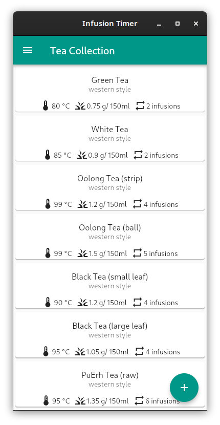
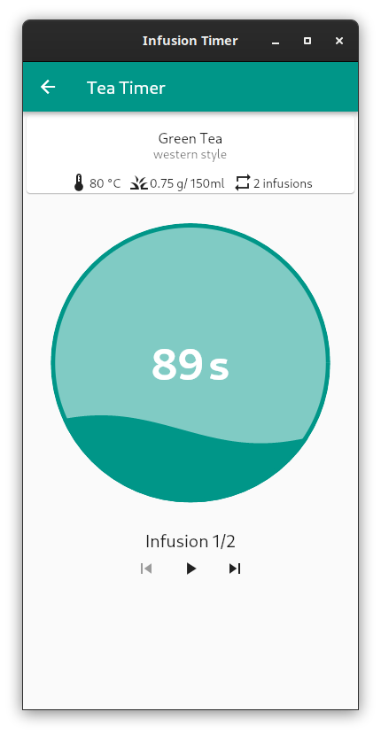
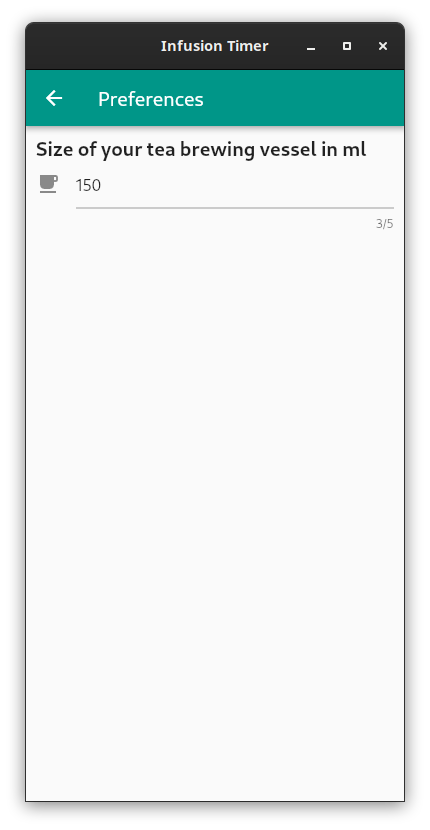

# Infusion Timer

This is a tea timer app made with Flutter. Its unique feature is that it supports multiple infusions. The app comes with a defaul list of teas but you can also add your own. Many thanks to [Mei Leaf](https://meileaf.com/) for their permission to include default data from their brewing guide!

## Screenshots

## Licenses
Copyright (c) 2021 Sesu8642

Unless otherwise specified, source code in this repository is licensed under the GNU General Public License, Version 3 or later (GPL-3.0-or-later). A copy is included in the COPYING file.

Assets in this repository are licensed under variious other licenses:

- **assets/icon_simple***: Gaiwan Icon © 2021 by [Sesu8642](https://github.com/sesu8642) is licensed under [CC BY-SA 4.0](http://creativecommons.org/licenses/by-sa/4.0/?ref=chooser-v1)
- **assets/hand-bell-ringing-sound.wav**: CC BY 4.0 (see assets/hand-bell-ringing-sound.txt)
- **assets/default_data.json**: copyright meileaf 2016

## Creating Release Artifacts
### Android
- create a file key.properties in /android/key.properties (template should be there)
- modify flutter path in build_release.sh
- run build_release.sh