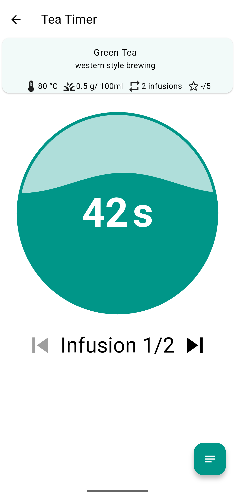
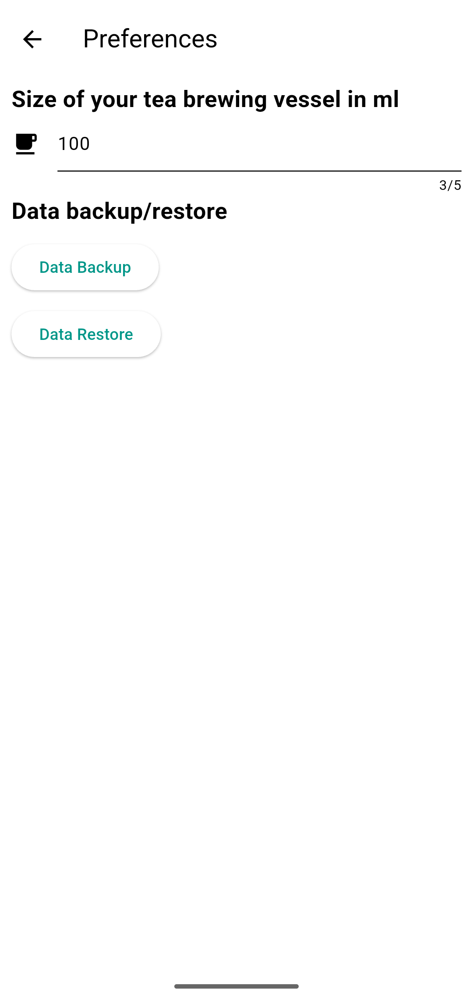

# Infusion Tea Timer

Tea timer app made with Flutter. Its unique feature is that it supports multiple infusions. The app comes with a default list of teas, but you can also add your own. Many thanks to [Mei Leaf](https://meileaf.com/) for their permission to include default data from their brewing guide!

## Screenshots

## Troubleshooting

If the countdown is much faster than expected, it's probably connected to a UI speed. It occurred at least with GrapheneOS. Other alternative android builds may be problematic as well.

### 1. Enable Developer mode
1. Tap on the "Settings" (gear icon) icon to open the setting on your Android device.
2. On the Android Settings screen, tap on "About phone" option (sometimes also "System" > "Advanced" > "About Phone").
3. Start tapping on the "Build number" option, and you will see a pop-up message that you are now "X" steps away from being a developer. Continue tapping on the 4. Build number option until you see a screen to Re-enter your password. Once you enter your device password, it will show a message at the bottom of the screen: You are now a developer.

### 2. Fix the UI-related bug
1. Go to the "Settings" -> "System" -> "Developer options".
2. Switch the "Window animation scale" and "Transition animation scale" from "Animation off" to "Animation scale 1x," then put them back to "Animation off."

## Licenses
Copyright (c) 2021 Sesu8642

Unless otherwise specified, source code in this repository is licensed under the GNU General Public License, Version 3 or later (GPL-3.0-or-later). A copy is included in the COPYING file.

Assets in this repository are licensed under various other licenses:

- **assets/icon_simple***: Gaiwan Icon © 2021 by [Sesu8642](https://github.com/sesu8642) is licensed under [CC BY-SA 4.0](http://creativecommons.org/licenses/by-sa/4.0/?ref=chooser-v1)
- **assets/hand-bell-ringing-sound.wav**: CC BY 4.0 (see assets/hand-bell-ringing-sound.txt)
- **assets/default_data.json**: copyright meileaf 2016

## Creating Release Artifacts
### Android
- create a file key.properties in /android/key.properties (template should be there)
- modify flutter path in build_release.sh
- run build_release.sh
